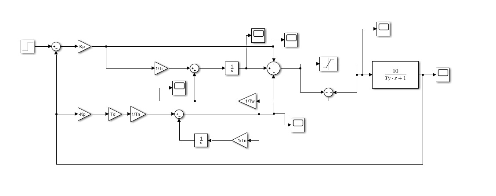

# FixedPID

This is a powerfull [PID controller](https://en.wikipedia.org/wiki/PID_controller) able to run without floating point unit, using integer arithmetic only

## Schematics
   

## Configuration
This PID use the engineering configuration where all parameter are function of `Kp` this is cheap because when you find a stable configuration changin `Kp` allows you to speed up and down the process. Other parameters are time constant, of the PID actions.

### Parameters
| Parameter 	|            Name           	| Equivalent notation 	| Typical value 	|
|:---------:	|:-------------------------:	|:---------------------:|:---------------:|
|     Kp    	|     Proportional gain     	|       Kp , Kp       	|       -       	|
|     Ti    	|  Integrator time constant 	| Ki=Kp/Ti , Ti=Kp/Ki 	|       -       	|
|     Td    	|  Derivative time constant 	| Kd=Kp*Td , Td=Kd/Kp 	|       -       	|
|     Tn    	|    Noise time constant    	|  fn=1/Tn , Tn=1/fn  	|     T*2.5     	|
|     T     	|       Sampling time       	|   SR=1/T , T=1/SR   	| Look your ADC 	|
|     Tw    	| Anti-windup time constant 	|       Tw , Tw       	|      Ti/5     	|
|   Ulim[0] 	|       Min output           	|          -   	        |Min process input|
|   Ulim[1] 	|       Max output           	|          -   	        |Max process input|

You can also set `realDerivative`, a boolean to choose if you want to read input from a derivative sensor instead of extimate the derivative numerically. If you have a derivative sensor you can improve a lot the working. If you are using `realDerivative` you should map the sensor output at D input, in this configuration you will have a contribute of you derivative sensor with a gain of Kp*Td.

You have also to set the `finput` function, it allow you to choose the PID port mapping, the PID will call this function to get new input, see later.

### Inputs
This PID has 3 inputs:
- PI input
- D input
- Antiwindup input

User can change the ports mapping however I suggest you to leave D input connected to process output, in order to avoid peaks when reference changing. Btw you can connect D to error like simplest PIDs.

## Usage
Declare a `PID` structure and a `InitParameters` structure and call `pidInit()`
```
PID mypid;
InitParameters mypars;
mypars.T = 1e-5f;
mypars.Kp = 1;
mypars.Ti = 0.1f;
mypars.Td = 0.1f;
mypars.Tw = mypars.Ti / 5;
mypars.Tn = 1e-3f;
mypars.Ulim[0] = -1;
mypars.Ulim[1] = 1;
mypars.realDerivative = false;
mypars.finput = loopInput;
	
pidInit(&mypid, &mypars);
```
Input parameters are in `float`, don't worry, it converts in `int32_t` during initialization.

The `finput` function must have the following form:
```
void loopInput(int32_t U[3], int32_t wo, void* arg) { ... }
```
This function will be called from PID when it need new input, so you can map the ports inside, to do this edit the U array:
- U[0] PI input (typical value: error = reference - process_output)
- U[1] Antiwindup signal input (typical value: `wo`)
- U[2] Derivative input (typical value: process_output)

 `arg` is an arbitrary pointer to a resource that the PID will pass to the function.
 
 This is a `finput` example:
 ```
void loopInput(int32_t U[3], int32_t wo, void* arg)
{
	args_s *x = (args_s*)arg;
	int32_t Ref = x->ref; //PID reference 

	int32_t Py = ReadSensor(); // Read process output and use it to make PI feedback

	U[0] = Ref - Py; // Make PI feedback
	U[1] = wo; // Manage anti-windup
	U[2] = Py; // Use process output as derivative input
}
 ```
 To make a PID step you shold call the function `pidStep()`
```
while(!end)
{
	u = pidStep(&mypid, &arg);
	SetProcessInput(u);
	end = checkEnd();
	sleep(T);
}
```
`pidStep()` returns the PID output, that will be the process input, in typical usecase.


