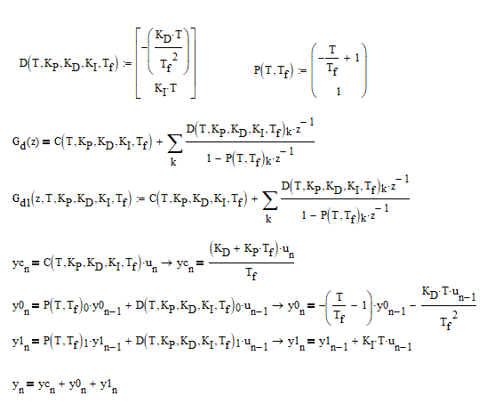

# SimplePID
Fast [PID controller](https://en.wikipedia.org/wiki/PID_controller) implemented in parallel form.

## Derivation

Analog PID transfer function:

Discrete PID transfer function calculated by Euler method:

Transfer function comparsion (G_a: analog, G_d discrete):

Parallel decomposition:

